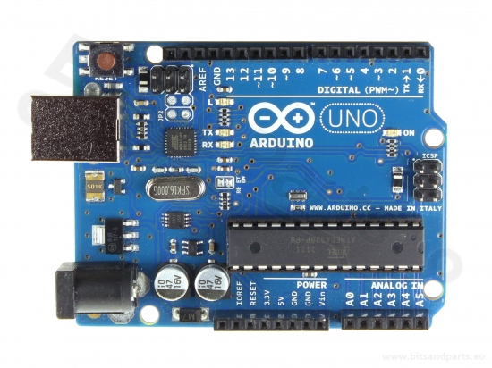

# Arduino UNO

In deze workshop gaan we aan de slag met de Arduino UNO. De Arduino UNO is een microcontroller board gebaseerd op de ATmega328P. Het is een van de meest populaire en veelzijdige microcontroller boards, ideaal voor beginners en ervaren makers.

Figuur 1.	Arduino UNO

## Kenmerken van de Arduino UNO
- Microcontroller: ATmega328P
- Operating Voltage: 5V
- Input Voltage (recommended): 7-12V
- Input Voltage (limits): 6-20V
- Digital I/O Pins: 14 (waarvan 6 kunnen worden gebruikt als PWM-uitgangen)
- Analog Input Pins: 6
- Flash Memory: 32 KB (ATmega328P) van welke 0.5 KB wordt gebruikt door de bootloader
- SRAM: 2 KB (ATmega328P)
- EEPROM: 1 KB (ATmega328P)
- Clock Speed: 16 MHz   
