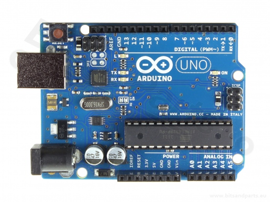

# Arduino Uno

In deze workshop werken we met de Arduino Uno. De Arduino Uno is een microcontrollerboard op basis van de ATmega328P. Het is een populair en veelzijdig board, geschikt voor zowel beginners als gevorderden.

*Figuur 1. Arduino Uno*

## Kenmerken van de Arduino Uno

- Microcontroller: ATmega328P
- Operating voltage: 5 V
- Input voltage (recommended): 7-12 V
- Input voltage (limits): 6-20 V
- Digital I/O pins: 14 (waarvan 6 als PWM-uitgang)
- Analog input pins: 6
- Flash memory: 32 KB (waarvan 0,5 KB gebruikt door de bootloader)
- SRAM: 2 KB
- EEPROM: 1 KB
- Clock speed: 16 MHz
