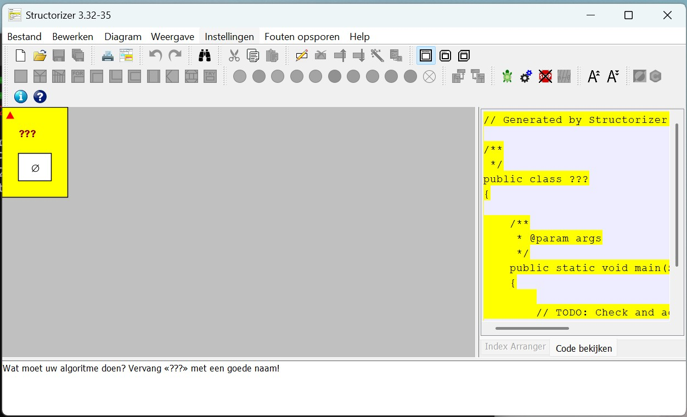
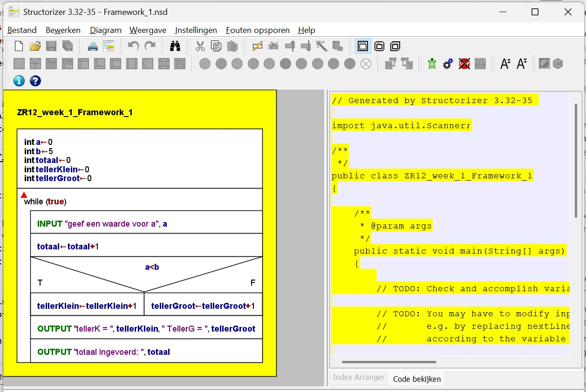
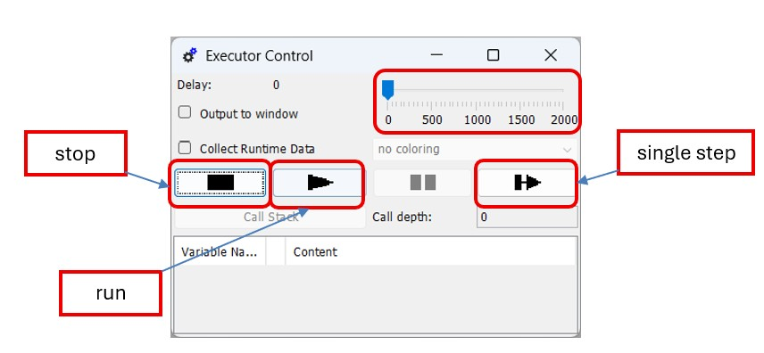

# Opdracht 1: Oefenen met PSD's
In deze opdracht ga je aan de slag met het maken van programma's in Structorizer. Structorizer is een tool waarmee je programma's kunt ontwerpen en simuleren met behulp van Programma Stroom Diagrammen (PSD's). In deze opdracht leer je hoe je de basisconstructies van programmeren kunt toepassen in PSD's en hoe je deze kunt uitvoeren en debuggen met de Executor-functie van Structorizer. 

## Opdracht 1.1: Structorizer en Java installeren

Installeer de volgende software:

- `Structorizer`: simulatiepakket voor PSD's. Dit wordt in dit practicum gebruikt om te oefenen met de drie basisstructuren van programmeren. De laatste versie is ook te downloaden via: [Structorizer](https://structorizer.fisch.lu/)
  - Kies op de site onder `Downloads` de `windows installer`
  - Het bestand wordt gedownload naar je `Downloads`-map. 
  - Dubbelklik op het bestand `structorizer.exe` om de installatie te starten. Volg de instructies op het scherm om Structorizer te installeren.
- `Java`: te downloaden via: [Java](https://www.java.com/nl/)
  - Kies op de site onder `Java Java voor desktops` de `Gratis Java Download`-knop
  - Het bestand wordt gedownload naar je `Downloads`-map.
  - Dubbelklik op het bestand `jre-xux-windows-x64.exe` om de installatie te starten. Volg de instructies op het scherm om Java te installeren.
- `Java SE Development Kit (JDK)`, versie `21.0.9 of later`. JDK versie 21.0.9 staat op Brightspace bij `Software`. De JDK is ook te downloaden via: [Java SE Development Kit (JDK)](https://www.techspot.com/downloads/7703-java-21.html)
  - Probeer nu zelf de JDK te installeren. Volg de instructies op het scherm om de JDK te installeren. Zorg ervoor dat je de JDK installeert en niet alleen de JRE, omdat de JDK nodig is voor het ontwikkelen van Java-toepassingen.

:::{warning}
Soms verandert de site van de softwareleverancier, waardoor de downloadlinks kunnen veranderen. probeer te alle tijde hier eerst zelf voor een oplossing te zoeken. Als je problemen blijft ondervinden bij het downloaden of installeren van de software, neem dan contact op met de docent voor verdere assistentie.
:::

Test of de software correct is geïnstalleerd: Klik op het Start-menu en zoek naar `Structorizer`. Klik op de applicatie om deze te openen. Als Structorizer correct is geïnstalleerd, zou het programma moeten starten zonder foutmeldingen. Je zou een venster moeten zien waarin je nieuwe projecten kunt maken of bestaande projecten kunt openen.

    *Figuur 1: Structorizer programma*

## Opdracht 1.2: Basisconstructies in PSD's

Gebruik voor deze opdracht het project `Framework_1.nsd`. 
- Dit bestand kun je vinden in de map `opdracht1/structorizer` van de microcontrollers workshop. Zie [Installatie-instructies](install.md) voor meer informatie over het verkrijgen van de workshopbestanden.

*Figuur 1: Structorizer met framework 1*

Dit Structorizer-programma telt:

- het totaal aantal ingevoerde (gehele) getallen;
- hoeveel van die getallen kleiner zijn dan 5;
- hoeveel getallen groter dan of gelijk aan 5 zijn.

Voer daarna de volgende stappen uit:

1. Voer het programma uit via `Debug > Executor` (zie figuur 1). Zet de delay op 0. Start vervolgens met de `Run`-knop en controleer of het programma de hierboven beschreven functionaliteit heeft.
2. Voer het programma opnieuw uit via `Debug > Executor`, maar zet eerst de delay op ongeveer 400. Start daarna met de `Run`-knop en volg de programmastroom tijdens de uitvoering.
3. Voer het programma opnieuw uit via `Debug > Executor`, maar start nu met de `Single Step`-knop. Druk herhaaldelijk op deze knop en volg de programmastroom in het PSD. Let ook op de waarden van de variabelen tijdens de uitvoering.
4. Pas het programma aan: voeg een teller toe die bijhoudt hoe vaak de waarde 5 is ingevoerd. Toon deze tellerwaarde ook. Gebruik de variabelenaam `teller5`.
5. Pas het programma opnieuw aan: voeg een teller toe die bijhoudt hoe vaak de waarde 0 is ingevoerd. Toon deze tellerwaarde ook. Gebruik de variabelenaam `teller0`.

*Figuur 3: Executor window*

## Opdracht 1.3: Berekenen van het gemiddelde van een lijst getallen

Gebruik voor deze opdracht het project `Framework_2.nsd`.

Maak in Structorizer een programma dat het gemiddelde berekent van een lijst met in te voeren niet-negatieve getallen (dus positief of 0). Het programma moet aan de volgende eisen voldoen:

1. Er moet minimaal een getal worden ingevoerd.
2. Het einde van de lijst met in te voeren niet-negatieve getallen wordt aangegeven met de waarde -1. Deze waarde telt niet mee voor het berekenen van het gemiddelde.
3. Als de invoer van de lijst wordt afgesloten met de waarde -1, moeten het gemiddelde en het aantal ingevoerde getallen worden weergegeven.
4. Het programma herhaalt zich oneindig.

## Opdracht 1.4: Uitbreiding van opdracht 1.3

Breid de uitwerking van opdracht 3 zodanig uit dat ook wordt geteld hoe vaak de waarde 0 in de invoerlijst voorkomt. Laat deze waarde ook zien.

## Opdracht 1.5: Inleveren van de opdracht

Maak een screenshot van je Structorizer-programma en de uitvoer ervan. Zorg ervoor dat de screenshot duidelijk laat zien dat je programma correct werkt en voldoet aan de eisen van de opdracht. Lever vervolgens de screenshot in via Brightspace bij `Opdracht 1: Oefenen met PSD's`. Zorg ervoor dat je de opdracht op tijd inlevert, zodat je feedback kunt ontvangen en eventuele verbeteringen kunt aanbrengen.