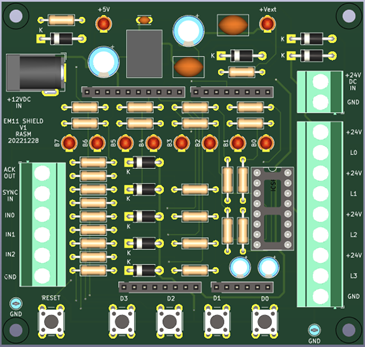
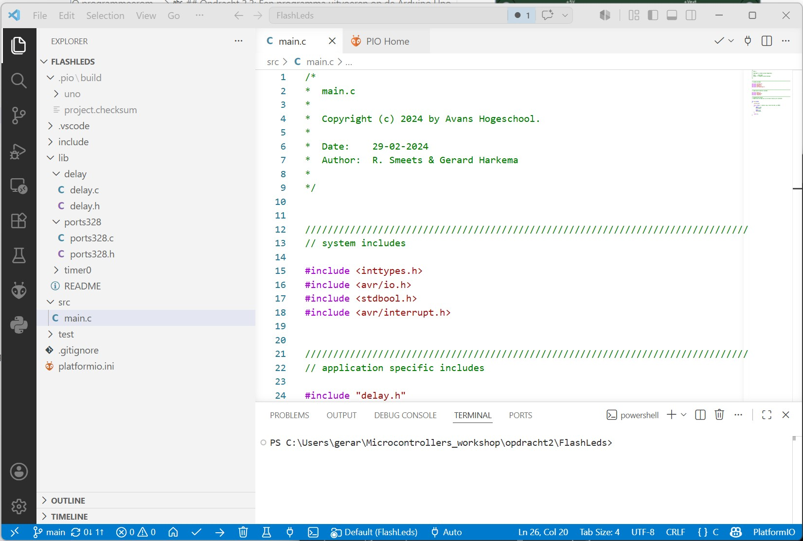
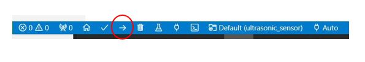
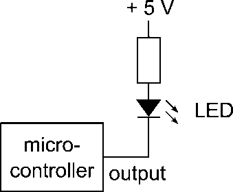
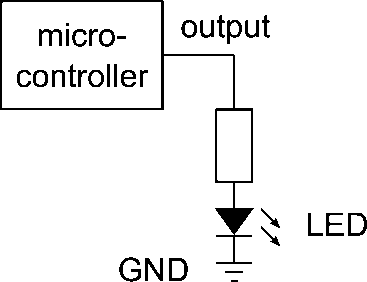
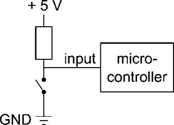
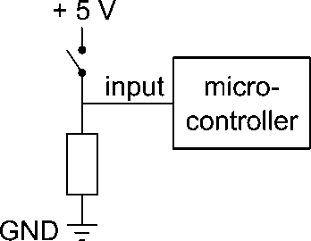

# Opdracht 2: Kennismaken met de Arduino Uno en PlatformIO

In deze opdracht maak je kennis met de Arduino Uno en de bijbehorende programmeeromgeving PlatformIO. Je leert hoe je een programma schrijft in C, hoe je dit programma compileert en flasht naar de Arduino Uno, en hoe je de LED's en schakelaars op het LED/switch-shield aanstuurt en uitleest.

:::{note}
Tijdens de uitvoering van deze opdracht houd je een rapportage bij. Gebruik hiervoor het document `Rapportage_Opdracht_2.docx` in de map `opdracht2` van de microcontrollers workshop. Dit bestand lever je in op Brightspace.
:::

## Opdracht 2.1: Installatie van Visual Studio Code en PlatformIO

:::{note}
Deze opdracht voer je in je eigen tijd uit, voordat je met het practicum begint. Als je de software nog niet hebt geinstalleerd, heb je geen toegang tot het practicum.
:::

Voor het programmeren van de Arduino Uno gebruik je Visual Studio Code met de PlatformIO-extensie. Volg deze stappen:

1. Download en installeer Visual Studio Code via <https://code.visualstudio.com/>.
2. Open Visual Studio Code en ga naar Extensions (`Ctrl+Shift+X`).
3. Zoek op `PlatformIO` en installeer de extensie.
4. Herstart Visual Studio Code na installatie.

## Opdracht 2.2: Een programma uitvoeren op de Arduino Uno

De Arduino Uno wordt gebruikt in combinatie met een shield dat nodig is voor communicatie met de PLC en het aansturen van de signaalzuil. In het practicum gebruik je de schakelaars en LED's op dit shield (zie figuur 1).



*Figuur 1. Positie van schakelaars en LED's*

Om een programma op de Arduino Uno uit te voeren, moet het programma vanaf de pc naar de Arduino worden geflasht. Dit doe je met PlatformIO.

1. Open in Visual Studio Code het project `FlashLeds` door de map `opdracht2/FlashLeds` te openen (`File > Open Folder`).



*Figuur 2. Visual Studio Code met PlatformIO-extensie*

2. Compileer het programma met het vinkje (check-icoon) in de onderste balk of met `Ctrl+Alt+B`. Controleer of er geen compileerfouten zijn.


3. Plaats het shield op de Arduino Uno en sluit de Arduino Uno met een USB-kabel aan op de pc.
4. Flash het programma met het upload-icoon in de onderste balk of met `Ctrl+Alt+U`. Controleer of de LED's op het shield knipperen zoals verwacht.



## Opdracht 2.3: Een eenvoudig programma in C

C-programma 1 laat zien hoe de LED's op het shield kunnen worden aangestuurd. In dit programma worden de LED's steeds 500 ms aan en 500 ms uit gezet.

```cpp
int main(void)
{
	initPorts();
	initTimer();

	while (true) // endless loop, flash the LED's on PORTD
	{
		PORTD = 255;
		delay(500);

		PORTD = 0;
		delay(500);
	}

	return 0;
}
```

*C-programma 1. Het programma FlashLeds*

Open `main.c` in `opdracht2/FlashLeds/src`.

Pas C-programma 1 zo aan dat de LED's twee keer zo traag knipperen. Voeg hiervoor de regels toe zoals in C-programma 2. Sla het programma op, compileer het en flash het naar de Arduino.

```cpp
int main(void)
{
	initPorts();
	initTimer();

	while (true) // endless loop, flash the LED's on PORTD
	{
		PORTD = 255;
		delay(500);
		delay(500); // voeg deze regel toe

		PORTD = 0;
		delay(500);
		delay(500); // voeg deze regel toe
	}

	return 0;
}
```

*C-programma 2. Het aangepaste programma FlashLeds*

## Opdracht 2.4: Onderzoek aansturen LED's

Een LED kan op twee manieren op een microcontroller worden aangesloten (figuur 3 en figuur 4). Onderzoek op welke manier de LED's op het Arduino LED/switch-shield zijn aangesloten:

1. Maak eerst een aanname over het gedrag van de LED's.
2. Controleer deze aanname met een programma. Gebruik `PORTD` om de LED's aan te sturen.

::::{grid} 2
:::{grid-item-card}


**Figuur 3. Output/LED aangesloten op voedingsspanning**
:::
:::{grid-item-card}


**Figuur 4. Output/LED aangesloten op ground**
:::
::::

Werk daarna uit:

1. Open in Visual Studio Code het project `LedTest` door de map `opdracht2/LedTest` te openen (`File > Open Folder`).
2. Flash het programma naar de Arduino Uno.
3. Open `main.c` en bestudeer dit programma. Controleer of dit programma de LED's aanstuurt zoals verwacht.
4. Vul tabel 1 in. Neem aan: logische `1` is +5 Volt en logische `0` is 0 Volt. Vul per figuur in of de LED `AAN` of `UIT` is.

| | Output = 0 | Output = 1 |
| --- | --- | --- |
| Figuur 3 | | |
| Figuur 4 | | |

*Tabel 1. Gedrag van LED's op de uitgang van een microcontroller*

5. Trek een conclusie:

- Een LED is `AAN` als de output een logische ... is.
- Een LED is `UIT` als de output een logische ... is.

## Opdracht 2.5: Onderzoek inlezen schakelaars

1. Open in Visual Studio Code het project `SwitchTest` door de map `opdracht2/SwitchTest` te openen (`File > Open Folder`).
2. Flash het programma naar de Arduino Uno.
3. Open `main.c`, bestudeer het programma en probeer te begrijpen wat het doet.

Gebruik voor deze opdracht de kennis uit `LedTest` (opdracht 2.4).

:::{warning}
We hebben 4 schakelaars en 8 LED's. Kijk in deze opdracht alleen naar LED's B3..B0 (de 4 meest rechtse LED's). LED's 7..4 hebben een andere functie.
:::

Een schakelaar kan op twee manieren op een microcontroller worden aangesloten (figuur 5 en figuur 6). Onderzoek hoe de schakelaars op het Arduino LED/switch-shield zijn geconfigureerd.

::::{grid} 2
:::{grid-item-card}


**Figuur 5. Input/schakelaar aangesloten op ground**
:::
:::{grid-item-card}


**Figuur 6. Input/schakelaar aangesloten op voedingsspanning**
:::
::::

4. Vul tabel 2 in. Neem aan: logische `1` is +5 Volt en logische `0` is 0 Volt. Vul per figuur in of de schakelaar `IN` of `LOS` is.

| | Input = 0 | Input = 1 |
| --- | --- | --- |
| Figuur 5 | | |
| Figuur 6 | | |

*Tabel 2. Gedrag van schakelaars op de ingang van een microcontroller*

5. Onderzoek daarna of een ingedrukte schakelaar een `0` of juist een `1` oplevert op de ingang van de microcontroller.
6. Maak een aanname.
7. Controleer de aanname met een programma.

Gebruik `PINB` om vier schakelaars tegelijk in te lezen. Gebruik ook de conclusies uit de vorige opdracht over het LED-gedrag.

*Aanwijzingen:*

- Maak een programma dat continu de status van de schakelaars weergeeft op de LED's (alleen de 4 rechtse LED's).
- Bepaal of een ingedrukte schakelaar een `0` of een `1` geeft op de ingang.

*Conclusie:*

- Een ingedrukte schakelaar genereert een logische ... op de ingang van de microcontroller.
- Een losgelaten schakelaar genereert een logische ... op de ingang van de microcontroller.

## Opdracht 2.6: Teller

1. Open in Visual Studio Code het project `Teller` door de map `opdracht2/Teller` te openen (`File > Open Folder`).
2. Flash het programma naar de Arduino Uno.
3. Open `main.c`, bestudeer het programma en probeer te begrijpen wat het doet.

Pas het programma zo aan dat op de LED's van het LED/switch-shield een binaire teller zichtbaar is die elke halve seconde omhoog telt. De beginwaarde van de teller is `0`.

Het programma moet niet alleen correct tellen, maar ook logisch en leesbaar opgebouwd zijn. Er moet dus ergens een opdracht staan met een plus-operator, bijvoorbeeld:

```cpp
teller = teller + 1;
```

:::{note}
Het programma is fout als het ergens een opdracht bevat in de vorm:

```cpp
teller = teller - 1;
```
:::

## Opdracht 2.7: Inleveren van de opdrachten

Lever je rapportage in op Brightspace. Gebruik hiervoor het document `Rapportage_Opdracht_2.docx` in de map `opdracht2` van de microcontrollers workshop. In dit document vul je de antwoorden op de vragen en je conclusies per opdracht in.