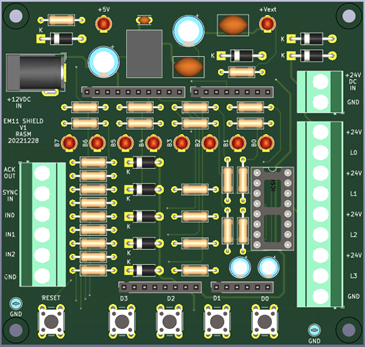
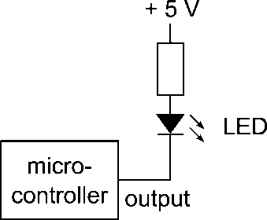
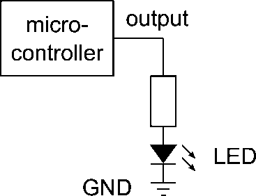
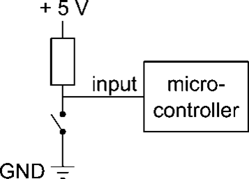
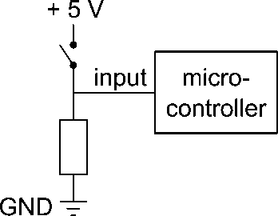

# Opdracht 3: De Arduino Uno en de PlatformIO programmeeromgeving 

**Deze opdracht moet nog worden herschreven**

## Opdracht 1: Een programma uitvoeren op de Arduino Uno

De Arduino Uno wordt gebruikt in combinatie met een zgn. shield, dat nodig is voor communicatie met de PLC en dat de signaalzuil gaat aansturen. In het practicum worden de schakelaars en de LED’s op dit shield gebruikt. In figuur 1 zijn deze aangegeven.





Figuur 1.	Positie van schakelaars en LED’s


 
Om een programma op de Arduino Uno uit te voeren moet dit programma worden gedownload (‘geflasht’) van de PC naar de Arduino. Hiervoor wordt het programma XLoader gebruikt, zie figuur 1 voor een screenshot van de user interface.


 

Figuur 2	User interface van XLoader

Het programma XLoader moet worden gebruikt om het programma, dat in een zgn. HEX-file staat, te flashen op de Arduino.

Voer de volgende stappen uit om een knipperlicht te downloaden dat alle 8 LED’s op het Arduino shield laat knipperen:

1.	Zorg ervoor dat alle benodigde drivers voor de Arduino zijn geïnstalleerd. Zie ook http://arduino.cc/

2.	Haal het bestand FlashLeds.hex van Brightspace en sla dit op je harde schijf (of USB stick, of homedrive, of...) op.

3.	Sluit de Arduino aan op een USB poort.

4.	Start XLoader

5.	Selecteer in XLoader als device: Uno(ATmega328)

6.	Selecteer in XLoader de juiste COM port

7.	Zorg ervoor dat in XLoader de baudrate is ingesteld op 115200

8.	Selecteer de HEX-file FlashLeds.hex

9.	Druk op de knop Upload. Alle 8 LED’s op het shield moeten nu knipperen.
 
Opdracht 2.	Een eenvoudig programma in de taal C


Voor het programmeren van C-code voor de Arduino Uno moet gebruik worden gemaakt van Microchip Studio (oude naam: Atmel Studio), deze ondersteunt de ATmega328. Deze versie van Atmel Studio staat op Brightspace bij ‘Software > Atmel Studio’

Het bestand FlashLeds.hex uit opdracht 1 is het resultaat van het compileren (vertalen van C-code naar binaire machinecode) van een C programma waarvan het hoofdprogramma is gegeven in figuur 3:


```cpp
int main(void)
{
	InitPorts();
	InitTimer();

	while (true) // endless loop, flash the LED's on PORTD
	{
		PORTD = 255;
		delay(500);

		PORTD = 0;
		delay(500);
	}

	return 0;
}
```


Figuur 3.	Het programma FlashLeds


1.	Op Brightspace staat het bestand FlashLeds.zip. Dit bestand bevat het volledige Microchip Studio project waarin ook bovenstaande C-code staat. Haal dit zip-bestand van Brightspace en unzip dit in een geschikte map.

2.	Open het project door de zgn. solution te openen in Microchip Studio, of door te dubbelklikken op het bestand FlashLeds.atsln.

3.	Compileer / build het project en flash de nieuw gegenereerde hex-file naar de Arduino. Het nieuwe gegenereerde hex-bestand staat in de submap ‘Debug’ van de projectmap.

4.	Pas het programma van figuur 3 zodanig aan, dat de LED’s 2 maal zo traag knipperen. Voeg hiervoor de programmaregels in zoals aangegeven in figuur 4. Save & compileer het programma en download het op de Arduino. Controleer uiteraard of de LED’s daadwerkelijk 2 maal zo traag knipperen!


```cpp
int main(void)
{
	InitPorts();
	InitTimer();

	while (true) // endless loop, flash the LED's on PORTD
	{
		PORTD = 255;
		delay(500);
		delay(500); // voeg deze regel toe

		PORTD = 0;
		delay(500);
		delay(500); // voeg deze regel toe
	}

	return 0;
}
```


Figuur 4.	Het aangepaste programma FlashLeds


 
Opdracht 3.	Onderzoek aansturen LED’s


De uitwerking van de volgende opdrachten (1 en 2) moet worden uitgelegd aan de docent(en), waarna de opdracht wordt afgetekend.

Haal voor de uitvoering van deze opdracht het bestand LedTest.zip van Brightspace  en unzip dit bestand in een geschikte map.

Een LED kan in principe op de volgende manieren op een microcontroller worden aangesloten, zie figuur 5 en figuur 6. De vraag is nu: op welke van deze mogelijke 2 manieren zijn de LED’s nu daadwerkelijk aangesloten op het Arduino LED / switch shield? Onderzoek dit door:

1.	eerst een aanname te maken over het gedrag van de LED’s, en vervolgens

2.	deze aanname te controleren met een programma. Gebruik PORTD om de LED’s aan te sturen.


::::{grid} 2
:::{grid-item-card} 

Figuur 5.
Output / LED aangesloten
op voedingsspanning	
:::
:::{grid-item-card}

Figuur 6.
Output / LED aangesloten
op ground

:::
::::


1.	Als een logische 1 op de output van de microcontroller wordt voorgesteld door +5 Volt, en een logische 0 door 0 volt, geef dan in de volgende tabel aan, wanneer een LED aan of uit is. Vul in deze tabel AAN of UIT in. Gebruik in het programma LedTest PORTD als output poort voor de LED’s.


|  | Output = 0 | Output = 1
| --- | --- | --- |
Figuur 5|	
Figuur 6| 


Tabel 1.		Gedrag van LED’s op de uitgang van een microcontroller (invullen)

2.	Op welke manier zijn nu de LED’s op het LED / switch shield van de Arduino Uno aangesloten, m.a.w.: gaat een LED branden bij een ‘0’ op de uitgang van de microcontroller, of juist bij een ‘1’? 

Conclusie:

•	Een LED is AAN als de output een logische … is
•	Een LED is UIT als de output een logische … is
 
Opdracht  4.	Onderzoek inlezen schakelaars 


De uitwerking van de volgende opdrachten (1 en 2) moet worden uitgelegd aan de docent(en), waarna de opdrachten wordt afgetekend.

Haal voor de uitvoering van deze opdracht het bestand SwitchTest.zip van Brightspace en unzip dit bestand in een geschikte map.

Maak voor de uitvoering van deze opdracht gebruik van het programma en de kennis die je hebt gebruikt bij opdracht 3 (LedTest).

LET OP: omdat we slechts 4 schakelaars hebben (en 8 LED’s), kijken we bij deze opdracht UITSLUITEND naar het gedrag van de LED’s B3…B0, d.w.z de 4 meest RECHTSE LED’s op het shield. Kijk dus NIET naar de LED’s 7..4 links op het shield, deze hebben hier nl. een andere functie en kunnen aan of uit zijn.

Op 4 ingangen van poort B zijn 4 schakelaars aangesloten. Een schakelaar kan in principe op de volgende manieren op een microcontroller worden aangesloten, zie figuur 6 en figuur 7. In deze opdracht wordt bepaald op welke van deze mogelijke 2 manieren de schakelaars nu daadwerkelijk zijn geconfigureerd op het Arduino LED / switch shield.


 ::::{grid} 2
:::{grid-item-card} 

Figuur 7.
Input / schakelaar aangesloten
op ground	
:::
:::{grid-item-card}

Figuur 6.
Input / schakelaar aangesloten
op voedingsspanning
:::
::::			 


Figuur 7.					Figuur 8.

Input / schakelaar aangesloten		Input / schakelaar aangesloten 
op ground				op voedingsspanning


1.	Als een logische 1 op de input van de microcontroller wordt voorgesteld door +5 Volt, en een logische 0 door 0 volt, geef dan in de volgende tabel aan, wanneer een schakelaar is ingedrukt of losgelaten. Vul in deze tabel IN of LOS in.

|  | Input = 0 | Input = 1
| --- | --- | --- |
Figuur 7 |	
Figuur 8| 


Tabel 1.		Gedrag van schakelaars op de ingang van een microcontroller


2.	Op welke manier zijn nu de schakelaars aangesloten? M.a.w.: stelt een ingedrukte schakelaar een ‘0’ voor op de ingang van de microcontroller, of juist een ‘1’? Onderzoek dit door:

1.	een aanname te maken, en vervolgens

2.	deze aanname te controleren met een programma. 

Gebruik input poort B (PINB) om 4 schakelaars tegelijk in te lezen. Maak ook gebruik van de conclusies die getrokken zijn uit het gedrag van de LED's in de vorige opdracht. Lees vooral ook de volgende 2 aanwijzingen!

Aanwijzingen:

•	maak een programma dat voortdurend de status van de schakelaars weergeeft op de LED’s (kijk dus alleen naar de 4 RECHTER LED’s, de 4 linker LED’s doen niet mee in deze opdracht)

•	Bepaal nu of een ingedrukte schakelaar een ‘0’ geeft op de ingang of juist een ‘1’.


Conclusie:

•	Een schakelaar die is ingedrukt genereert een logische … op de ingang van de microcontroller
•	Een schakelaar die is losgelaten genereert een logische … op de ingang van de microcontroller
 
Practicumopdracht 1.7	Teller

De uitwerking van de volgende opdrachten moet worden gedemonstreerd aan de docent(en), waarna de opdrachten worden afgetekend

Haal voor de uitvoering van deze opdracht het bestand Teller.zip van Brightspace en unzip dit bestand in een geschikte map.

Pas dit programma zodanig aan, dat het programma op de LED’s van het LED / switch shield een (binaire) teller laat zien, die elke ½ seconde omhoog telt. De beginwaarde van de teller is 0. Maak, indien nodig, gebruik van een PSD in microAVR om dit vooraf te testen.

Het programma moet niet alleen het juiste telgedrag vertonen op de LED’s, het moet daarnaast ook een logische, leesbare, begrijpelijke en duidelijke structuur hebben: in dit geval (het programma moet omhoog tellen) betekent het, dat er dus 'ergens' in dit programma een opdracht moet staan met een '+' teken, zoals in:

teller = teller + 1


N.B.: het programma is verkeerd, als dit programma ergens een opdracht bevat van de vorm 

teller = teller - 1

waarbij er gebruik wordt gemaakt van een min-teken!

