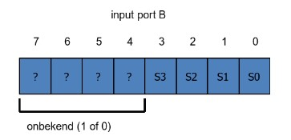
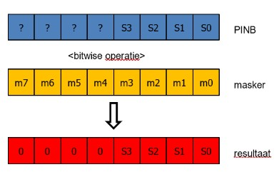

# Opdracht 3: Programmeren in C op de Arduino Uno

In dit practicum wordt geoefend met operaties op bits en met herhalings- en beslissingsstructuren in de taal C.

## Inleiding

Op de Arduino Uno zijn de 8 LEDS op het shield aangesloten op output poort D (PORTD), en de 4 schakelaars op input poort B (PINB). Input poort B is echter een 8 bit input poort, waarvan alleen bits 3..0 gebruikt worden voor de schakelaars. Bits 7..4 zijn in gebruik voor andere functies van de microcontroller. De actuele waarde van de bits 7..4 is onbekend: er mag nooit worden verondersteld dat ze een specifieke en bekende waarde hebben (0 of 1, dus). De waarde die gelezen wordt van input poort B is dus:

*Figuur 1. Input port B*

Om uitsluitend de waarde van de schakelaars S3 .. S0 in te lezen, is het handig om ervoor te zorgen dat met één of andere bitwise operatie de bits 7..4 altijd als een logische 0 worden geïnterpreteerd. Dit wordt maskeren genoemd, zie figuur 2:

*Figuur 2. Maskeren van input port B*

Beantwoord eerst de volgende vraag, alvorens te beginnen aan de uitwerking begint van de opdrachten (na het beantwoorden van deze vraag kunnen onderstaande opdrachten succesvol worden uitgevoerd!)

Welke operatie, en welk masker (dus de waarde van de bits m7..m0) zijn nodig om het gewenste resultaat te krijgen volgens figuur 2?

## Opdracht 3.1: if-statement en bitwise AND operatie

1. Open in VisualStudio Code het `Framework_3_1`-project door de map `opdracht3/Framework_3_1` te openen.
2. Open het `main.c` bestand in Visual Studio Code en bestudeer dit programma. 

3. Maak een programma `main.c` dusdanig dat het de LEDs laat knipperen, zolang één of meer willekeurige schakelaar(s) is/zijn ingedrukt. Als geen schakelaar is ingedrukt, dan zijn de LEDs uit.
:::{tip}
- Laat je voor het knipperen van de LEDs inspireren door het programma `FlashLeds` dat je in de opdrachten 2 hebt gebruikt.
- Maak gebruik van het if-statement
:::

4. Pas het programma nu zodanig aan, dat uitsluitend schakelaar 0 deze functie heeft. Het indrukken van een andere schakelaar mag geen effect hebben.
:::{tip}
Maak gebruik van een bitwise AND operatie om te controleren of schakelaar 0 is ingedrukt.
:::

 
## Opdracht 3.2: if-statement en bitwise AND operatie
1. Open in VisualStudio Code het `Framework_3_2`-project door de map `opdracht3/Framework_3_2` te openen.
2. Open het `main.c` bestand in Visual Studio Code en bestudeer dit programma. 
  - je kunt eventueel ook het programma `main.c` van opdracht 3.1 gebruiken als startpunt voor deze opdracht, maar zorg er dan wel voor dat je dit programma eerst kopieert naar de map `opdracht3/Framework_3_2/src` voordat je aan de uitwerking van deze opdracht begint.

3. Maak een programma `main.c` dusdanig dat het de LEDs laat knipperen, zolang één of meer willekeurige schakelaar(s) is/zijn ingedrukt. Als geen schakelaar is ingedrukt, dan blijven de LEDs in de laatste stand staan.

4. Pas het programma nu zodanig aan, dat uitsluitend schakelaar 1 deze functie heeft. Het indrukken van een andere schakelaar mag geen invloed hebben.

## Opdracht 3.3: if-statement en bitwise AND operatie
1. Open in VisualStudio Code het `Framework_3_3`-project door de map `opdracht3/Framework_3_3` te openen.
2. Open het `main.c` bestand in Visual Studio Code en bestudeer dit programma. 

- Maak een programma zodat de LEDs bij het indrukken van een willekeurige schakelaar 1 seconde gaan branden. Het moet daarbij niet uitmaken hoelang de schakelaar wordt ingedrukt.

- Pas het programma nu zodanig aan, dat uitsluitend schakelaar 2 deze functie heeft. Het indrukken van een andere schakelaar mag geen invloed hebben.

## Opdracht 3.4: if-statement en bitwise AND operatie
1. Open in VisualStudio Code het `Framework_3_4`-project door de map `opdracht3/Framework_3_4` te openen.
2. Open het `main.c` bestand in Visual Studio Code en bestudeer dit programma. 
3. Maak een programma dat de LEDs laat branden zolang een willekeurige schakelaar is ingedrukt. Na het loslaten van de schakelaar blijven de LEDs nog 1 seconde branden.
4. Pas het programma nu zodanig aan, dat uitsluitend schakelaar 3 deze functie heeft. Het indrukken van een andere schakelaar mag geen invloed hebben.

## Opdracht 3.5: bitwise operaties en herhalingsstructuren
1. Open in VisualStudio Code het `Framework_3_5`-project door de map `opdracht3/Framework_3_5` te openen.
2. Open het `main.c` bestand in Visual Studio Code en bestudeer dit programma. 

Maak een programma dat in een oneindige herhaling:

3. Alle LED’s één voor één aanzet en het resultaat 1 seconde laat zien, te beginnen bij LED 0. De LED’s die aan zijn, blijven aan (bij aanvang zijn alle LED’s uit)

4. Zodra alle LED’s aan zijn, moeten ze weer één voor één worden uitgezet, te beginnen bij LED 0. De LED’s die uit zijn, blijven uit.

:::{tip}
- Maak gebruik van een variabele met de naam leds van het type uint8_t
- Maak gebruik van herhalingen (naar keuze while/do, do/while of for)
- Maak gebruik van een bit set operatie om LED’s aan te zetten
- Maak gebruik van een bit clear operatie om LED’s uit te zetten
- Maak gebruik van een shift operatie
:::
