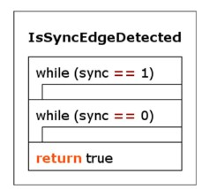
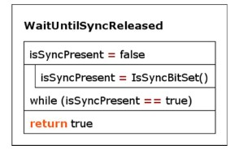
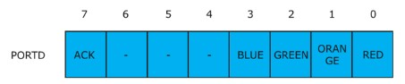
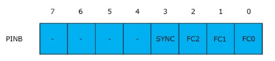

# Opdracht 5: Simulatie van signaallamp-besturing

In dit practicum implementeer je functies die nodig zijn voor de simulatie van het volledige besturingsprogramma van de signaallampen:

- `bool IsSyncEdgeDetected(void)` (zie week 5)
- `uint8_t GetPLCData(void)`
- `uint8_t GetFunctionCode(uint8_t inputData)`
- `void ControlLamps(uint8_t functionCode)`
- `void SetAcknowledge(void)`
- `void WaitUntilSyncReleased(void)`
- `void ClearAcknowledge(void)`
- `void SetSyncLed(bool ledOn)`

Deze functies komen overeen met de functies in het PSD van het volledige programma (figuur 1).

*Figuur 1. PSD van het volledige besturingsprogramma*

:::{tip}
- Het is niet verplicht om PSD's te maken, maar dit mag wel als verduidelijking.
- Open in Visual Studio Code het project `Framework_5` door de map `opdracht5/Framework_5` te openen.
- Voeg op de aangegeven plekken de uitwerkingen van onderstaande opdrachten toe.
- Demonstreer de uitwerking van de opdrachten aan de docent.
:::

Maak in onderstaande volgorde de C-code voor de volgende functies.
## Opdracht 5.1: Implementatie van de functie `void SetSyncLed(bool ledOn)` 
Maak een functie met de volgende specificaties:
	- LED B6 wordt gebruikt als indicatie voor het SYNC-bit.
	- `ledOn == true`: zet de SYNC-LED aan.
	- `ledOn == false`: zet de SYNC-LED uit.
	- Test deze functie door haar in `main()` aan te roepen en een knipperlicht te maken.

## Opdracht 5.2: Implementatie van de functie `bool IsSyncBitSet(void)`
Deze functie is nodig voor de implementatie van `IsSyncEdgeDetected()` in van opdracht 5.3. De functie heeft de volgende specificaties:
	- Als het SYNC-bit `1` is, retourneert de functie `true`; bij `0` retourneert de functie `false`.
	- Laat de functie bij simulatie reageren op drukknop D3, en niet op het echte SYNC-bit.

	N.B.: op het shield hebben knoppen een geinverteerde werking. Een ingedrukte knop levert logische `1`, een niet-ingedrukte knop logische `0`. Houd hiermee rekening in `IsSyncBitSet()` en in `GetPLCData()`.

	Breid de test uit stap 1 uit met `IsSyncBitSet()` en controleer of de functie correct reageert op het indrukken van knop D3 (simulatie van activeren van SYNC).

## Opdracht 5.3: Implementatie van de functie `bool IsSyncEdgeDetected(void)` 
Zie ook de theorie van week 5 en het conceptuele PSD in figuur 2.

*Figuur 2. Conceptueel PSD van `IsSyncEdgeDetected`*

Deze functie blijft actief “wachten” op een opgaande flank (“rising edge”) van het SYNC signaal. Zodra deze optreedt geeft de functie de waarde “true” terug. N.B.: deze functie geeft nooit de waarde “false” terug, omdat deze (oneindig) lang wacht op een opgaande flank. Breid het testprogramma van stap 2 uit, of pas het aan, met de nieuwe functie IsSyncEdgeDetected die is gemaakt in de voorgaande stap 2, om te bepalen of deze functie correct reageert op het indrukken van knop D3.

## Opdracht 5.4: Implementatie van de functie `void WaitUntilSyncReleased(void)`
Deze functie “wacht” totdat het SYNC bit in input port B niet meer actief is. Zie ook het conceptuele PSD in figuur 3. N.B.: maak deze functie zodanig, dat deze bij simulatie op drukknop D3 reageert, en NIET op het “echte” SYNC-bit! Breid het testprogramma van stap 3 uit, of pas het aan, met de nieuwe functie WaitUntilSyncReleased, om te bepalen of deze functie correct reageert op het LOSLATEN van knop D3 (loslaten van deze knop simuleert het wegvallen van het SYNC signaal).

 

*Figuur 3. PSD van `WaitUntilSyncReleased`*

## Opdracht 5.5: Implementatie van de functie `void ControlLamps(uint8_t functionCode)`
	- Stuur de signaallampen correct aan,  de parameter functionCode bepaalt welke signaallampen dat zijn, zie tabel 1.

functiecode | bit 1 | bit 2 | bit 3 | lampen aan | betekenis
--- | --- | --- | --- | --- | ---
0 | 0 | 0 | 0 | groen | run
1 | 0 | 0 | 1 | geel |standby
2 | 0 | 1 | 0 | rood | alarm
3 | 0 | 1 | 1 | groen + geel | run + service
4 | 1 | 0 | 0 | rood + geel | standby + service
5 | 1 | 0 | 1 | blauw | ongeldige functiecode
6 | 1 | 1 | 0 | blauw | ongeldige functiecode
7 | 1 | 1 | 1 | alle | lamp test
*Tabel 1. Betekenis van functiecode en bijbehorende lampen*

De signaallampen worden aangestuurd via het output register van PORTD, zie figuur 4.

 

*Figuur 4.	Toekenning van de bits van output port D*

De bits 3..0 worden gebruikt voor de aansturing van de signaallampen, bit 7 is het ACK bit (acknowledge) dat gebruikt wordt voor de communicatie-handshake. Dit bit moet dus altijd logisch ‘0’ blijven, als de lampen worden aangestuurd!

De functie ControlLamps heeft als taak om de 3 bits functiecode te vertalen naar een correcte aansturing van de bits 3..0 van output port D.

Voor functionCode geldt dat 0 ≤ functionCode ≤ 7. Een waarde voor functionCode die buiten dit bereik ligt, moet worden genegeerd (lampen blijven ongewijzigd). Breid het testprogramma van stap 4 uit, of pas het aan, om te bepalen of deze functie de LED’s B3..B0 correct aanstuurt. Test alle geldige waarden 0..7 voor functionCode, én test ook met een ongeldige waarde, bv. 45.

## Opdracht 5.6: Implementatie van de functie `uint8_t GetPLCData(void)`
Deze functie leest input port B en geef de 4 bits data terug van bits 3..0. Bits 7..4 moeten worden gemaskeerd en moeten worden teruggegeven als ‘0’. Zie figuur 5 voor de toekenning van de bits in input port B. 

 

*Figuur 5.	Toekenning van de bits in input port B*

Deze returnwaarde van GetPLCData bevat dus zowel de 3-bits function code van bits 2..0, als de waarde (“status”) van het SYNC-bit in bit 3.

:::{note}
Maak deze functie zodanig, dat deze bij simulatie op drukknoppen D2..D0 reageert, en NIET op de “echte” bits van input port B. Breid het testprogramma van stap 5 uit, of pas het aan, om te bepalen of deze functie de juiste waarde teruggeeft van de knoppen D2..D0. Dit gebeurt in 2 stappen:
- Roep de functie GetPLCData aan, en bewaar de return value (die ligt tussen 0 en 15, ofwel 0x00 en 0x0F) in een variabele
- Geef deze variabele mee als parameter aan de functie ControlLamps.
- Voorbeeld: het indrukken van knop 0 en knop 1 geeft als resultaat de waarde 3, dat betekent dat zowel de groene als de gele LED aan moeten gaan (functiecode = 3).
:::

## Opdracht 5.7: Implementatie van de functie `uint8_t GetFunctionCode(uint8_t inputData)`
Deze functie heeft als input de waarde die de functie GetPLCData heeft teruggegeven, en bevat de 8 bits zoals aangegeven in bovenstaande figuur 5. Deze functie moet de waarde teruggeven van de 3 bits FC2..FC0, die gebruikt wordt om naderhand de juiste signaal-lampen aan te zetten. 

   De functie maskeert dus zowel de bits 7..4 en bit 3 (het SYNC bit) met een ‘0’en geeft een returnwaarde tussen 0 en 7 (0x00 en 0x07).

## Opdracht 5.8: Implementatie van de functie `void SetAcknowledge(void)`
Deze functie set het ACK-bit in PORTD op “1”, zie ook figuur 4. N.B.: UITSLUITEND het ACK-bit moet worden geset, de overige bits 3..0 die de signaallampen aan- of uitzetten, moeten dus ONGEWIJZIGD blijven!! Gebruik dus de juiste bit-set en/of bit-clear operatie!

## Opdracht 5.9: Implementatie van de functie `void ClearAcknowledge(void)`
Deze functie cleart het ACK-bit in PORTD op “0”, zie ook figuur 4. N.B.: UITSLUITEND het ACK-bit moet worden gecleard, de overige bits 3..0 die de signaallampen aan- of uitzetten, moeten dus ONGEWIJZIGD blijven!! Gebruik dus de juiste bit-set en/of bit-clear operatie!

 
## Uitvoeren simulatie met de drukknoppen en de LED’s

In de theorieles is aangegeven hoe de simulatie moet gebeuren om de volledige code functioneel te testen. Doe dit als volgt:

1.	Simuleer een functiecode met een waarde tussen 0 en 7 door het indrukken van 0 of meer van de drukknoppen D2..D0 (maximaal 3 vingers nodig…). Houd de gewenste knoppen ingedrukt.

2.	Druk vervolgens op drukknop D3 om een opgaande flank van het SYNC signaal te simuleren.

3.	Bij een correcte simulatie gaan de bijbehorende LED’s B3..B0 aan, evenals de SYNC LED (LED B6).

- LED B0 simuleert de kleur ROOD van de lampzuil
- LED B1 simuleert de kleur GEEL van de lampzuil
- LED B2 simuleert de kleur GROEN van de lampzuil
- LED B3 simuleert de kleur BLAUW van de lampzuil

4.	Bij een correcte simulatie gaat ook LED B7 aan (meest rechter LED): op het shield is deze nl. rechtstreeks gekoppeld aan het ACK (acknowledge) signaal.

5.	Laat de drukknoppen D2..D0 los.

6.	Laat drukknop D3 los, dit simuleert het inactief worden van het SYNC signaal.

7.	Bij een correcte simulatie gaat zowel de SYNC LED (LED B7) als de ACK LED (LED B6) uit. De LED’s B3..B0 houden hun waarde!

## Opdracht 5.10: Inleveren van de opdrachten

Lever je rapportage in op Brightspace. Gebruik hiervoor het document `Rapportage_Opdracht_5.docx` in de map `opdracht5` van de microcontrollers workshop. In dit document vul je de antwoorden op de vragen en de conclusies van de verschillende opdrachten in.