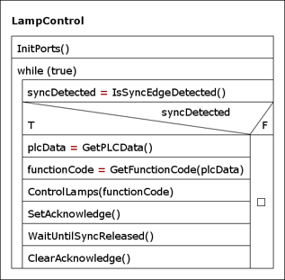
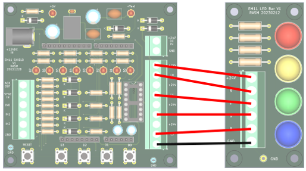
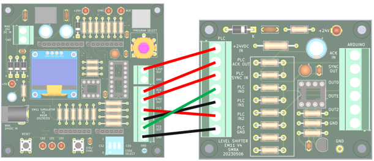
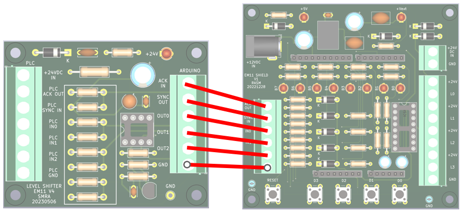

# Opdracht 6: Testen en simuleren van de signaallamp-besturing

## 6.1 Inleiding

In dit practicum test je het programma voor de signaallamp-besturing. Het PSD van het volledige programma staat in figuur 1.

*Figuur 1. PSD van het volledige besturingsprogramma*

:::{tip}
- Gebruik de uitwerkingen van de practica van week 8. Deze bevatten al alle benodigde functionele code.
- Het is niet verplicht om PSD's te maken, maar dit mag wel ter verduidelijking.
- Gebruik `FrameworkWeek8.zip` van Brightspace.
- Pak het bestand uit in een geschikte map (bij voorkeur op je homedrive op het Avans-netwerk).
- Open `FrameworkWeek8.atsln` in Microchip Studio.
- Voeg op de aangegeven plekken de uitwerkingen van onderstaande opdrachten in.
- Demonstreer de uitwerking van de opdrachten aan de docent.
:::

## 6.2 Integratie- en simulatietesten van de geimplementeerde functies

Alle code moet eerst worden getest voordat de Arduino met shield wordt aangesloten op de level shifter en de PLC van de transportband. Het testen is gefaseerd:

1. Testen en simuleren met alleen Arduino + shield.
2. Testen met Arduino + shield + PLC-simulator.
3. Testen met Arduino + shield + PLC (onderdeel van de SAT: Site Acceptance Test).

In dit practicum voer je simulatie 1 uit: testen met de knoppen op het shield.

## 6.3 Test 1: Arduino + shield

In deze test simuleer je het SYNC-signaal en de functiecode met de drukknoppen, en controleer je het gedrag via de LED's op het shield.

Deze simulatie wijkt af van test 2 en 3, omdat de knoppen op het shield geinverteerd werken: ingedrukt geeft logische `1`, niet-ingedrukt geeft logische `0`.

Pas voor deze simulatie alleen de benodigde code minimaal aan, in de functie `IsSyncBitSet()`.

N.B.: voor test 2 en 3 moet je weer de gewone (niet-aangepaste) versie van `IsSyncBitSet()` gebruiken.

De simulatie verloopt als volgt:

1. Simuleer een functiecode tussen `0` en `7` door 0 of meer knoppen D2..D0 in te drukken. Houd deze knoppen ingedrukt.
2. Druk vervolgens op knop D3 om een opgaande flank van het SYNC-signaal te simuleren.
3. Bij correcte simulatie gaan LED's B3..B0 aan, evenals de SYNC-LED (B6).
4. Bij correcte simulatie gaat ook LED B7 aan (meest rechter LED), omdat die op het shield direct gekoppeld is aan ACK.
5. Laat de knoppen D2..D0 los.
6. Laat knop D3 los (simulatie van inactief worden van SYNC).
7. Bij correcte simulatie gaan zowel de SYNC-LED (B6) als de ACK-LED (B7) uit.

## 6.4 Test 2: Arduino + shield + signaalzuil-simulator

Wanneer test 1 succesvol is uitgevoerd, sluit je de LED-bar met kleuren-LED's aan als simulatie van de signaalzuil. Controleer op dezelfde manier als in test 1 of de juiste kleuren worden aangestuurd.

Sluit Arduino-shield en LED-bar aan volgens tabel 1 en figuur 2.

| Arduino shield | LED-bar |
| --- | --- |
| +24V | +24V |
| L0 | R (red) |
| L1 | Y (yellow) |
| L2 | G (green) |
| L3 | N (blue) |

*Tabel 1. Aansluitingen Arduino-shield en LED-bar*

*Figuur 2. Aansluitingen Arduino-shield en LED-bar*

## 6.5 Test 3: Arduino + shield + level shifter + PLC-simulator

Wanneer test 2 succesvol is afgerond, vervang je de knopbesturing van de handshakesignalen door besturing via PLC-inputs. Daarvoor gebruik je een PLC-simulator via de level shifter.

N.B.: de level shifter moet voorzien zijn van de juiste weerstanden (zoals berekend bij het practicum Netwerken) en de spanningen moeten daar zijn gecontroleerd.

Sluit de PLC-simulator en de level shifter aan volgens tabel 2 en figuur 3.

| PLC-simulator | Level shifter |
| --- | --- |
| +24V OUT | +24VDC IN |
| ACK IN | PLC ACK OUT |
| SYNC OUT | PLC SYNC IN |
| FC2 OUT | PLC IN 2 |
| FC1 OUT | PLC IN 1 |
| FC0 OUT | PLC IN 0 |

*Tabel 2. Aansluitingen PLC-simulator en level shifter*

*Figuur 3. Aansluitingen PLC-simulator en level shifter*

Sluit vervolgens de level shifter en het Arduino-shield aan volgens tabel 3 en figuur 4.

| Level shifter | Arduino shield |
| --- | --- |
| ACK IN | ACK OUT |
| SYNC OUT | SYNC IN |
| OUT0 | IN0 |
| OUT1 | IN1 |
| OUT2 | IN2 |
| GND | GND |

*Tabel 3. Aansluitingen level shifter en Arduino-shield*

*Figuur 4. Aansluitingen level shifter en Arduino-shield*

Op de PLC-simulator zijn standaardprogramma's beschikbaar voor de signaalzuil (tabel 4).

| Simulatieprogramma | Functie |
| --- | --- |
| 0 | PLC-simulator staat uit en genereert geen handshake-signalen |
| 1 | Stuur permanent function code 0 uit (groen) |
| 2 | Stuur permanent function code 1 uit (geel) |
| 3 | Stuur permanent function code 2 uit (rood) |
| 4 | Stuur permanent function code 3 uit (groen + geel) |
| 5 | Stuur permanent function code 4 uit (rood + geel) |
| 6 | Stuur permanent function code 5 uit (blauw) |
| 7 | Stuur permanent function code 6 uit (blauw) |
| 8 | Stuur permanent function code 7 uit (blauw) |
| 9 | Stuur achtereenvolgens function codes 0 t/m 7 uit met tussenpauzes van een halve seconde |

*Tabel 4. PLC-simulatieprogramma's*

Met de draaiknop `PROGRAM SELECT` kies je het gewenste simulatieprogramma. Op het OLED-scherm zie je deze keuze en de functiecode.

Bij simulatieprogramma's 1 t/m 9 moet altijd een volledige handshake met SYNC en ACK worden uitgevoerd. Controleer status en foutmeldingen via de SYNC-LED, ACK-LED en het OLED-scherm.

Controleer of alle simulatieprogramma's uit tabel 4 correct werken. Zo niet:

1. Controleer eerst bedrading en aansluitingen.
2. Zoek daarna de fout in de Arduino-code en pas de code aan.

## 6.6 Test 4: Arduino + shield + LED-bar + level shifter + besturings-PLC

Wanneer test 3 succesvol is afgerond, voer je de integratietest uit met de PLC van de transportband, de level shifter en de Arduino.

Sluit hiervoor de level shifter aan op de PLC in plaats van op de PLC-simulator. Voer daarna het aangeleverde PLC-testprogramma uit zodat de juiste signalen worden gegenereerd.

## 6.7 Test 5: Arduino + shield + signaalzuil + level shifter + besturings-PLC

Wanneer test 4 succesvol is afgerond, vervang je de LED-bar door de signaalzuil. Controleer of de juiste kleuren op de lampen worden weergegeven.

